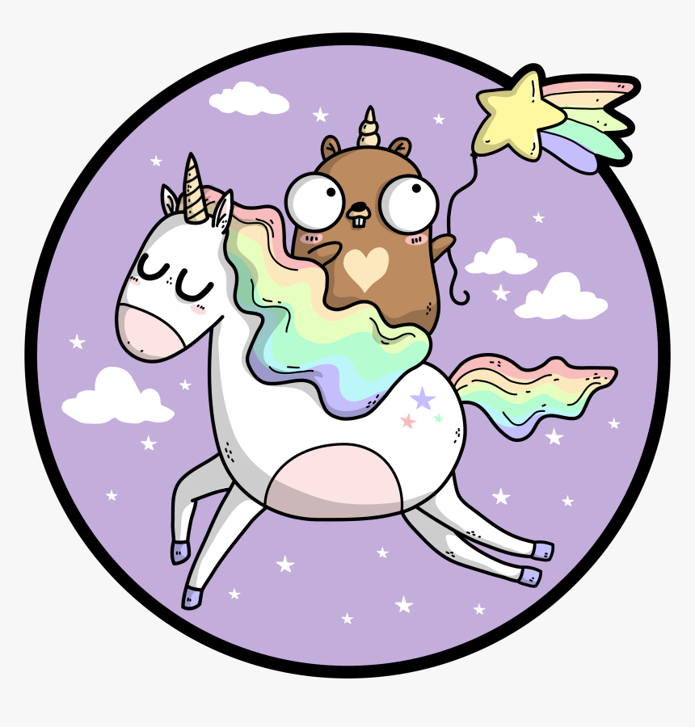

   
   # Software Developer, curious and a fan of golang!

   
   

   
   ## Technologies
   ###### *That I like and enjoy*
    
   
   
   
   
   
   
   
   
   
   
   
   
   
   

   
    
   

   
   

